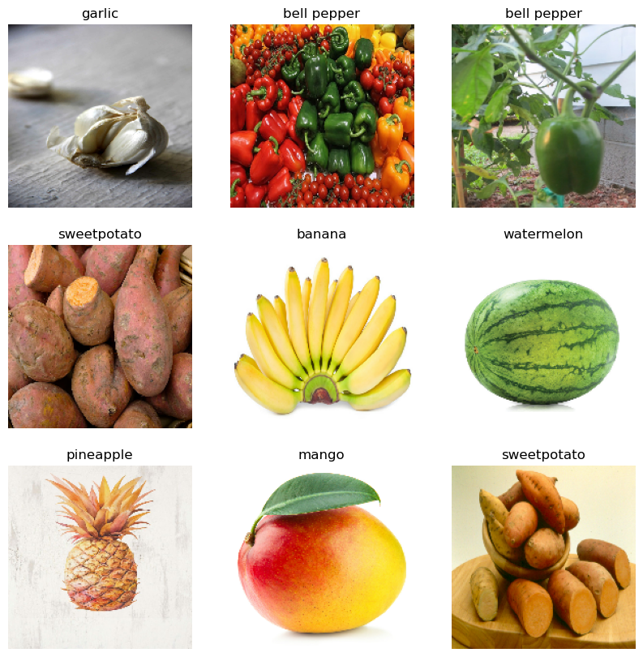
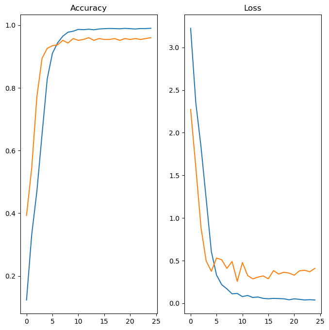

# Data Preprocessing & ready the  datset


```python
!pip install tensorflow
```

    Defaulting to user installation because normal site-packages is not writeable
    Requirement already satisfied: tensorflow in c:\users\bariu\appdata\roaming\python\python311\site-packages (2.14.0)
    Requirement already satisfied: tensorflow-intel==2.14.0 in c:\users\bariu\appdata\roaming\python\python311\site-packages (from tensorflow) (2.14.0)
    Requirement already satisfied: absl-py>=1.0.0 in c:\users\bariu\appdata\roaming\python\python311\site-packages (from tensorflow-intel==2.14.0->tensorflow) (2.0.0)
    Requirement already satisfied: astunparse>=1.6.0 in c:\users\bariu\appdata\roaming\python\python311\site-packages (from tensorflow-intel==2.14.0->tensorflow) (1.6.3)
    Requirement already satisfied: flatbuffers>=23.5.26 in c:\users\bariu\appdata\roaming\python\python311\site-packages (from tensorflow-intel==2.14.0->tensorflow) (23.5.26)
    Requirement already satisfied: gast!=0.5.0,!=0.5.1,!=0.5.2,>=0.2.1 in c:\users\bariu\appdata\roaming\python\python311\site-packages (from tensorflow-intel==2.14.0->tensorflow) (0.5.4)
    Requirement already satisfied: google-pasta>=0.1.1 in c:\users\bariu\appdata\roaming\python\python311\site-packages (from tensorflow-intel==2.14.0->tensorflow) (0.2.0)
    Requirement already satisfied: h5py>=2.9.0 in c:\programdata\anaconda3\lib\site-packages (from tensorflow-intel==2.14.0->tensorflow) (3.9.0)
    Requirement already satisfied: libclang>=13.0.0 in c:\users\bariu\appdata\roaming\python\python311\site-packages (from tensorflow-intel==2.14.0->tensorflow) (16.0.6)
    Requirement already satisfied: ml-dtypes==0.2.0 in c:\users\bariu\appdata\roaming\python\python311\site-packages (from tensorflow-intel==2.14.0->tensorflow) (0.2.0)
    Requirement already satisfied: numpy>=1.23.5 in c:\programdata\anaconda3\lib\site-packages (from tensorflow-intel==2.14.0->tensorflow) (1.24.3)
    Requirement already satisfied: opt-einsum>=2.3.2 in c:\users\bariu\appdata\roaming\python\python311\site-packages (from tensorflow-intel==2.14.0->tensorflow) (3.3.0)
    Requirement already satisfied: packaging in c:\programdata\anaconda3\lib\site-packages (from tensorflow-intel==2.14.0->tensorflow) (23.1)
    Requirement already satisfied: protobuf!=4.21.0,!=4.21.1,!=4.21.2,!=4.21.3,!=4.21.4,!=4.21.5,<5.0.0dev,>=3.20.3 in c:\users\bariu\appdata\roaming\python\python311\site-packages (from tensorflow-intel==2.14.0->tensorflow) (4.24.4)
    Requirement already satisfied: setuptools in c:\programdata\anaconda3\lib\site-packages (from tensorflow-intel==2.14.0->tensorflow) (68.0.0)
    Requirement already satisfied: six>=1.12.0 in c:\programdata\anaconda3\lib\site-packages (from tensorflow-intel==2.14.0->tensorflow) (1.16.0)
    Requirement already satisfied: termcolor>=1.1.0 in c:\users\bariu\appdata\roaming\python\python311\site-packages (from tensorflow-intel==2.14.0->tensorflow) (2.3.0)
    Requirement already satisfied: typing-extensions>=3.6.6 in c:\programdata\anaconda3\lib\site-packages (from tensorflow-intel==2.14.0->tensorflow) (4.7.1)
    Requirement already satisfied: wrapt<1.15,>=1.11.0 in c:\programdata\anaconda3\lib\site-packages (from tensorflow-intel==2.14.0->tensorflow) (1.14.1)
    Requirement already satisfied: tensorflow-io-gcs-filesystem>=0.23.1 in c:\users\bariu\appdata\roaming\python\python311\site-packages (from tensorflow-intel==2.14.0->tensorflow) (0.31.0)
    Requirement already satisfied: grpcio<2.0,>=1.24.3 in c:\users\bariu\appdata\roaming\python\python311\site-packages (from tensorflow-intel==2.14.0->tensorflow) (1.59.0)
    Requirement already satisfied: tensorboard<2.15,>=2.14 in c:\users\bariu\appdata\roaming\python\python311\site-packages (from tensorflow-intel==2.14.0->tensorflow) (2.14.1)
    Requirement already satisfied: tensorflow-estimator<2.15,>=2.14.0 in c:\users\bariu\appdata\roaming\python\python311\site-packages (from tensorflow-intel==2.14.0->tensorflow) (2.14.0)
    Requirement already satisfied: keras<2.15,>=2.14.0 in c:\users\bariu\appdata\roaming\python\python311\site-packages (from tensorflow-intel==2.14.0->tensorflow) (2.14.0)
    Requirement already satisfied: wheel<1.0,>=0.23.0 in c:\programdata\anaconda3\lib\site-packages (from astunparse>=1.6.0->tensorflow-intel==2.14.0->tensorflow) (0.38.4)
    Requirement already satisfied: google-auth<3,>=1.6.3 in c:\users\bariu\appdata\roaming\python\python311\site-packages (from tensorboard<2.15,>=2.14->tensorflow-intel==2.14.0->tensorflow) (2.23.3)
    Requirement already satisfied: google-auth-oauthlib<1.1,>=0.5 in c:\users\bariu\appdata\roaming\python\python311\site-packages (from tensorboard<2.15,>=2.14->tensorflow-intel==2.14.0->tensorflow) (1.0.0)
    Requirement already satisfied: markdown>=2.6.8 in c:\programdata\anaconda3\lib\site-packages (from tensorboard<2.15,>=2.14->tensorflow-intel==2.14.0->tensorflow) (3.4.1)
    Requirement already satisfied: requests<3,>=2.21.0 in c:\programdata\anaconda3\lib\site-packages (from tensorboard<2.15,>=2.14->tensorflow-intel==2.14.0->tensorflow) (2.31.0)
    Requirement already satisfied: tensorboard-data-server<0.8.0,>=0.7.0 in c:\users\bariu\appdata\roaming\python\python311\site-packages (from tensorboard<2.15,>=2.14->tensorflow-intel==2.14.0->tensorflow) (0.7.2)
    Requirement already satisfied: werkzeug>=1.0.1 in c:\programdata\anaconda3\lib\site-packages (from tensorboard<2.15,>=2.14->tensorflow-intel==2.14.0->tensorflow) (2.2.3)
    Requirement already satisfied: cachetools<6.0,>=2.0.0 in c:\users\bariu\appdata\roaming\python\python311\site-packages (from google-auth<3,>=1.6.3->tensorboard<2.15,>=2.14->tensorflow-intel==2.14.0->tensorflow) (5.3.2)
    Requirement already satisfied: pyasn1-modules>=0.2.1 in c:\programdata\anaconda3\lib\site-packages (from google-auth<3,>=1.6.3->tensorboard<2.15,>=2.14->tensorflow-intel==2.14.0->tensorflow) (0.2.8)
    Requirement already satisfied: rsa<5,>=3.1.4 in c:\users\bariu\appdata\roaming\python\python311\site-packages (from google-auth<3,>=1.6.3->tensorboard<2.15,>=2.14->tensorflow-intel==2.14.0->tensorflow) (4.9)
    Requirement already satisfied: requests-oauthlib>=0.7.0 in c:\users\bariu\appdata\roaming\python\python311\site-packages (from google-auth-oauthlib<1.1,>=0.5->tensorboard<2.15,>=2.14->tensorflow-intel==2.14.0->tensorflow) (1.3.1)
    Requirement already satisfied: charset-normalizer<4,>=2 in c:\programdata\anaconda3\lib\site-packages (from requests<3,>=2.21.0->tensorboard<2.15,>=2.14->tensorflow-intel==2.14.0->tensorflow) (2.0.4)
    Requirement already satisfied: idna<4,>=2.5 in c:\programdata\anaconda3\lib\site-packages (from requests<3,>=2.21.0->tensorboard<2.15,>=2.14->tensorflow-intel==2.14.0->tensorflow) (3.4)
    Requirement already satisfied: urllib3<3,>=1.21.1 in c:\programdata\anaconda3\lib\site-packages (from requests<3,>=2.21.0->tensorboard<2.15,>=2.14->tensorflow-intel==2.14.0->tensorflow) (1.26.16)
    Requirement already satisfied: certifi>=2017.4.17 in c:\programdata\anaconda3\lib\site-packages (from requests<3,>=2.21.0->tensorboard<2.15,>=2.14->tensorflow-intel==2.14.0->tensorflow) (2023.7.22)
    Requirement already satisfied: MarkupSafe>=2.1.1 in c:\programdata\anaconda3\lib\site-packages (from werkzeug>=1.0.1->tensorboard<2.15,>=2.14->tensorflow-intel==2.14.0->tensorflow) (2.1.1)
    Requirement already satisfied: pyasn1<0.5.0,>=0.4.6 in c:\programdata\anaconda3\lib\site-packages (from pyasn1-modules>=0.2.1->google-auth<3,>=1.6.3->tensorboard<2.15,>=2.14->tensorflow-intel==2.14.0->tensorflow) (0.4.8)
    Requirement already satisfied: oauthlib>=3.0.0 in c:\users\bariu\appdata\roaming\python\python311\site-packages (from requests-oauthlib>=0.7.0->google-auth-oauthlib<1.1,>=0.5->tensorboard<2.15,>=2.14->tensorflow-intel==2.14.0->tensorflow) (3.2.2)
    


```python
import numpy as np 
import pandas as pd
import matplotlib.pyplot as plt
import tensorflow as tf 

from tensorflow import keras
from tensorflow.keras import layers
```


```python
import os

# Specify the path to your dataset using an absolute path
data_train_path = os.path.abspath("C:\\Users\\bariu\\Python\\Image_Classification\\Fruits_Vegetables\\train")
data_test_path = os.path.abspath("C:\\Users\\bariu\\Python\\Image_Classification\\Fruits_Vegetables\\test")
data_val_path = os.path.abspath("C:\\Users\\bariu\\Python\\Image_Classification\\Fruits_Vegetables\\validation")

```


```python
# data_train_path = 'Python/Image_Classification/Fruits_Vegetables/train'
# data_train_test ='Python/Image_Classification/Fruits_Vegetables/test'
# data_train_val = 'Python/Image_Classification/Fruits_Vegetables/validation'
```

## set our images in similar size(fixed width & fixed height


```python
img_width = 180 
img_height = 180
```

## The tf.keras.utils.image_dataset_from_directory function is a convenient way to load image data from a directory structure and convert it into a TensorFlow dataset, which can be used for training machine learning models. This function handles various aspects such as reading images, resizing, shuffling, and batching, making it suitable for image classification tasks.


```python
data_train = tf.keras.utils.image_dataset_from_directory(
    data_train_path,
    shuffle=True,
    image_size=(img_width, img_height),
    batch_size=32,
    validation_split=False)
```

    Found 3115 files belonging to 36 classes.
    

## Show class_Name by this function and keep that function in a variable for later use


```python
data_cat=data_train.class_names
```


```python
data_cat
```


    ['apple',
     'banana',
     'beetroot',
     'bell pepper',
     'cabbage',
     'capsicum',
     'carrot',
     'cauliflower',
     'chilli pepper',
     'corn',
     'cucumber',
     'eggplant',
     'garlic',
     'ginger',
     'grapes',
     'jalepeno',
     'kiwi',
     'lemon',
     'lettuce',
     'mango',
     'onion',
     'orange',
     'paprika',
     'pear',
     'peas',
     'pineapple',
     'pomegranate',
     'potato',
     'raddish',
     'soy beans',
     'spinach',
     'sweetcorn',
     'sweetpotato',
     'tomato',
     'turnip',
     'watermelon']


```python
data_val = tf.keras.utils.image_dataset_from_directory(data_val_path,
                                                       image_size=(img_height, img_width),
                                                       batch_size=32,
                                                       shuffle=False,
                                                       validation_split=False)
```

    Found 351 files belonging to 36 classes.
    


```python
data_test = tf.keras.utils.image_dataset_from_directory(data_test_path,
                                                       image_size=(img_height, img_width),
                                                       shuffle=False,
                                                       batch_size=32,
                                                       validation_split=False)
```

    Found 359 files belonging to 36 classes.
    

## Let's print some images from training dataset


```python
plt.figure(figsize=(10,10))
for image, labels in data_train.take(1):
    for i in range(9):
        plt.subplot(3,3,i+1)
        plt.imshow(image[i].numpy().astype('uint8'))
        plt.title(data_cat[labels[i]])
        plt.axis('off')
```


    

    


# model creation

## create layers within model


```python
from tensorflow.keras.models import Sequential 
```


```python
data_train
```


    <_PrefetchDataset element_spec=(TensorSpec(shape=(None, 180, 180, 3), dtype=tf.float32, name=None), TensorSpec(shape=(None,), dtype=tf.int32, name=None))>


```python
model = Sequential([
    layers.Rescaling(1./255),
    layers.Conv2D(16,3, padding='same', activation='relu'),
    layers.MaxPooling2D(),
    layers.Conv2D(32,3,padding='same',activation='relu'),
    layers.MaxPooling2D(),
    layers.Conv2D(64,3,padding='same',activation='relu'),
    layers.MaxPooling2D(),
    layers.Flatten(),
    layers.Dropout(0.2),
    layers.Dense(128),
    layers.Dense(len(data_cat))
    
])
```

## already model has been created now model compiling 


```python
model.compile(optimizer='adam',loss=tf.keras.losses.SparseCategoricalCrossentropy(from_logits=True),metrics=['accuracy'])
```


```python
epochs_size = 25
history = model.fit(data_train, validation_data=data_val, epochs=epochs_size)
```

    Epoch 1/25
    98/98 [==============================] - 116s 1s/step - loss: 3.2249 - accuracy: 0.1230 - val_loss: 2.2729 - val_accuracy: 0.3932
    Epoch 2/25
    98/98 [==============================] - 95s 888ms/step - loss: 2.3506 - accuracy: 0.3316 - val_loss: 1.5963 - val_accuracy: 0.5442
    Epoch 3/25
    98/98 [==============================] - 75s 728ms/step - loss: 1.8370 - accuracy: 0.4700 - val_loss: 0.8890 - val_accuracy: 0.7721
    Epoch 4/25
    98/98 [==============================] - 84s 818ms/step - loss: 1.2253 - accuracy: 0.6523 - val_loss: 0.4953 - val_accuracy: 0.8946
    Epoch 5/25
    98/98 [==============================] - 88s 853ms/step - loss: 0.6061 - accuracy: 0.8289 - val_loss: 0.3745 - val_accuracy: 0.9259
    Epoch 6/25
    98/98 [==============================] - 97s 957ms/step - loss: 0.3303 - accuracy: 0.9101 - val_loss: 0.5298 - val_accuracy: 0.9345
    Epoch 7/25
    98/98 [==============================] - 119s 1s/step - loss: 0.2175 - accuracy: 0.9435 - val_loss: 0.5094 - val_accuracy: 0.9373
    Epoch 8/25
    98/98 [==============================] - 122s 1s/step - loss: 0.1681 - accuracy: 0.9647 - val_loss: 0.4084 - val_accuracy: 0.9516
    Epoch 9/25
    98/98 [==============================] - 121s 1s/step - loss: 0.1103 - accuracy: 0.9775 - val_loss: 0.4895 - val_accuracy: 0.9430
    Epoch 10/25
    98/98 [==============================] - 84s 819ms/step - loss: 0.1144 - accuracy: 0.9807 - val_loss: 0.2561 - val_accuracy: 0.9573
    Epoch 11/25
    98/98 [==============================] - 97s 954ms/step - loss: 0.0773 - accuracy: 0.9865 - val_loss: 0.4773 - val_accuracy: 0.9516
    Epoch 12/25
    98/98 [==============================] - 107s 1s/step - loss: 0.0911 - accuracy: 0.9856 - val_loss: 0.3252 - val_accuracy: 0.9544
    Epoch 13/25
    98/98 [==============================] - 104s 1s/step - loss: 0.0673 - accuracy: 0.9872 - val_loss: 0.2853 - val_accuracy: 0.9601
    Epoch 14/25
    98/98 [==============================] - 102s 996ms/step - loss: 0.0728 - accuracy: 0.9852 - val_loss: 0.3062 - val_accuracy: 0.9516
    Epoch 15/25
    98/98 [==============================] - 102s 992ms/step - loss: 0.0569 - accuracy: 0.9878 - val_loss: 0.3204 - val_accuracy: 0.9573
    Epoch 16/25
    98/98 [==============================] - 102s 996ms/step - loss: 0.0522 - accuracy: 0.9888 - val_loss: 0.2866 - val_accuracy: 0.9544
    Epoch 17/25
    98/98 [==============================] - 102s 987ms/step - loss: 0.0564 - accuracy: 0.9894 - val_loss: 0.3825 - val_accuracy: 0.9544
    Epoch 18/25
    98/98 [==============================] - 102s 1000ms/step - loss: 0.0544 - accuracy: 0.9891 - val_loss: 0.3421 - val_accuracy: 0.9573
    Epoch 19/25
    98/98 [==============================] - 104s 1s/step - loss: 0.0518 - accuracy: 0.9884 - val_loss: 0.3634 - val_accuracy: 0.9516
    Epoch 20/25
    98/98 [==============================] - 106s 1s/step - loss: 0.0403 - accuracy: 0.9897 - val_loss: 0.3534 - val_accuracy: 0.9573
    Epoch 21/25
    98/98 [==============================] - 101s 984ms/step - loss: 0.0512 - accuracy: 0.9888 - val_loss: 0.3289 - val_accuracy: 0.9544
    Epoch 22/25
    98/98 [==============================] - 102s 994ms/step - loss: 0.0455 - accuracy: 0.9878 - val_loss: 0.3797 - val_accuracy: 0.9573
    Epoch 23/25
    98/98 [==============================] - 103s 998ms/step - loss: 0.0379 - accuracy: 0.9891 - val_loss: 0.3866 - val_accuracy: 0.9544
    Epoch 24/25
    98/98 [==============================] - 103s 998ms/step - loss: 0.0418 - accuracy: 0.9891 - val_loss: 0.3692 - val_accuracy: 0.9573
    Epoch 25/25
    98/98 [==============================] - 103s 1s/step - loss: 0.0371 - accuracy: 0.9900 - val_loss: 0.4093 - val_accuracy: 0.9601
    


```python
epochs_size = 25
epochs_range = range(epochs_size)
plt.figure(figsize=(8,8))
plt.subplot(1,2,1)
plt.plot(epochs_range,history.history['accuracy'], label='Training Accuracy')
plt.plot(epochs_range,history.history['val_accuracy'], label='Validation Accuracy')
plt.title('Accuracy')

plt.subplot(1,2,2)
plt.plot(epochs_range,history.history['loss'], label='Training Loss')
plt.plot(epochs_range,history.history['val_loss'], label='Validation Loss')
plt.title('Loss')
```


    Text(0.5, 1.0, 'Loss')


    

    


## Now let's print the summary of the model


```python
model.summary()
```

    Model: "sequential_1"
    _________________________________________________________________
     Layer (type)                Output Shape              Param #   
    =================================================================
     rescaling_1 (Rescaling)     (None, 180, 180, 3)       0         
                                                                     
     conv2d_3 (Conv2D)           (None, 180, 180, 16)      448       
                                                                     
     max_pooling2d_3 (MaxPoolin  (None, 90, 90, 16)        0         
     g2D)                                                            
                                                                     
     conv2d_4 (Conv2D)           (None, 90, 90, 32)        4640      
                                                                     
     max_pooling2d_4 (MaxPoolin  (None, 45, 45, 32)        0         
     g2D)                                                            
                                                                     
     conv2d_5 (Conv2D)           (None, 45, 45, 64)        18496     
                                                                     
     max_pooling2d_5 (MaxPoolin  (None, 22, 22, 64)        0         
     g2D)                                                            
                                                                     
     flatten_1 (Flatten)         (None, 30976)             0         
                                                                     
     dropout_1 (Dropout)         (None, 30976)             0         
                                                                     
     dense_2 (Dense)             (None, 128)               3965056   
                                                                     
     dense_3 (Dense)             (None, 36)                4644      
                                                                     
    =================================================================
    Total params: 3993284 (15.23 MB)
    Trainable params: 3993284 (15.23 MB)
    Non-trainable params: 0 (0.00 Byte)
    _________________________________________________________________
    

# Predictiong Value from model


```python
image = "C:\\Users\\bariu\\Python\\Image_Classification\\apple.jpg"
image = tf.keras.utils.load_img(image,target_size= (img_height,img_width))
img_arr = tf.keras.utils.array_to_img(image)
img_bat = tf.expand_dims(img_arr,0)
```


```python
predict = model.predict(img_bat)
```

    1/1 [==============================] - 0s 26ms/step
    


```python
score = tf.nn.softmax(predict)
```


```python
print('Veg/Fruit in image is {} with accuracy of {:0.2f}' .format(data_cat[np.argmax(score)],np.max(score)*100)) 
```

    Veg/Fruit in image is apple with accuracy of 99.99
    


```python
model.save('Image_classify.keras') 
```
