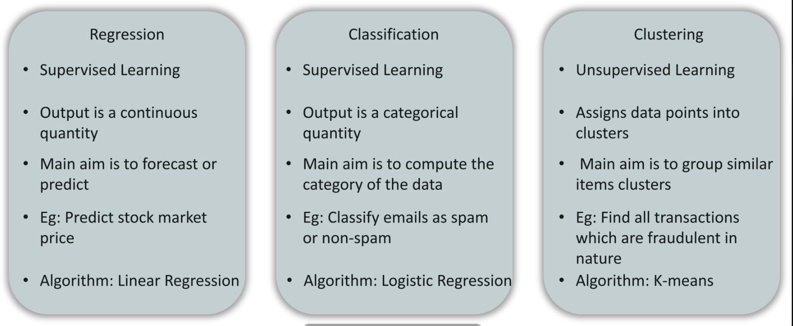
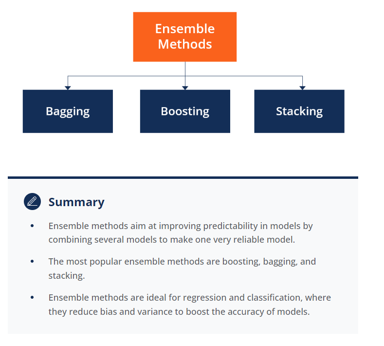
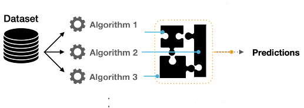
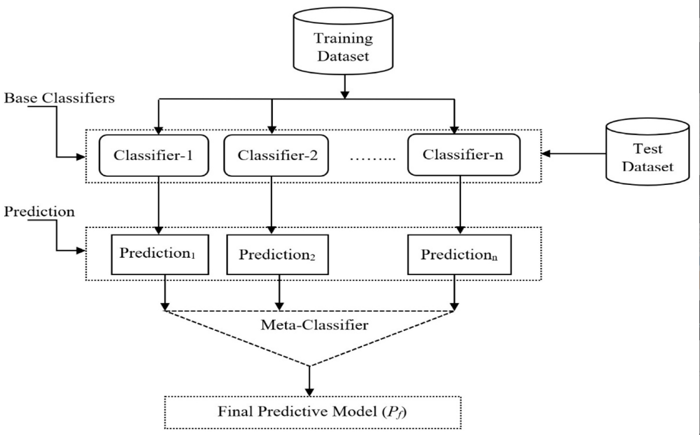
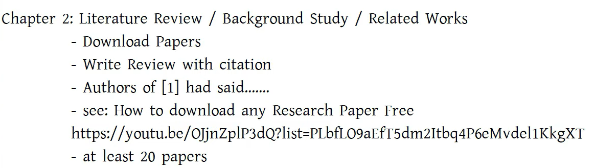
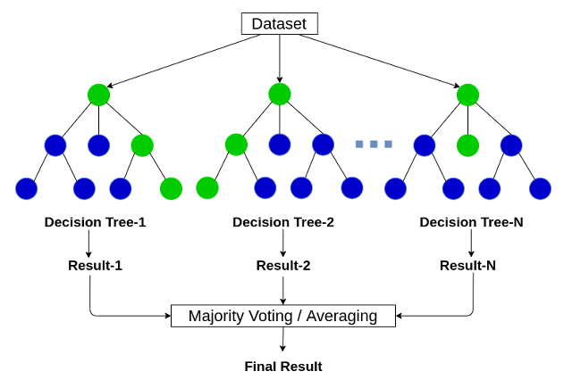
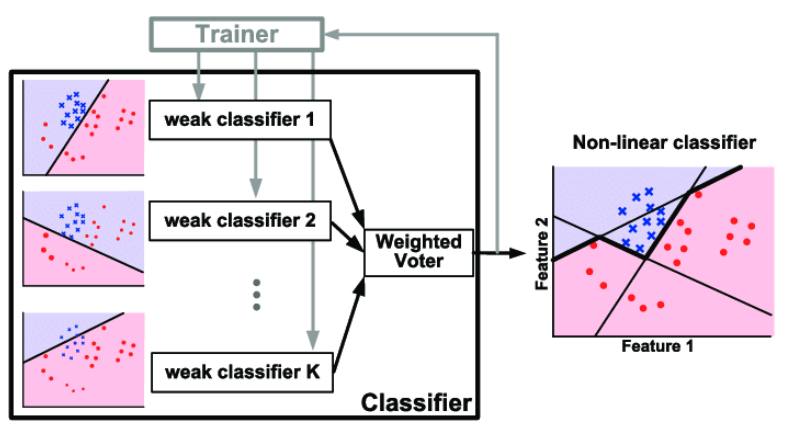
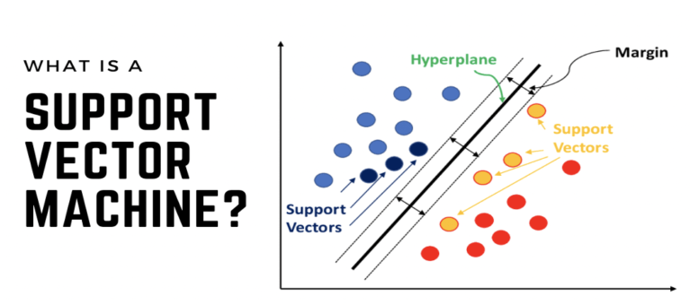
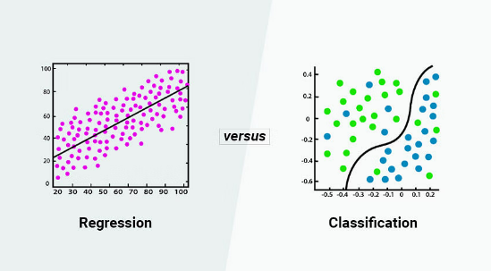
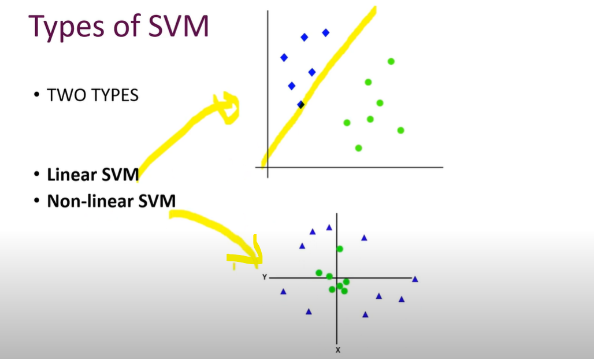

# Table of Contents 
- [Basic understanding](#basic-understanding)
- [Heart Diseases working step](#heat-diseases-working-step)
- [Ensemble methods in machine learning](#ensemble-methods-in-machine-learning)
- [What's Literature Review](#whats-literature-review)
- [Algorithm](#algorithm)   
- [what's EDA?](#whats-eda)   
- [How to improve the performance in Mach ine Learning?](#how-to-improve-the-performance-in-machine-learning)
- [Proposed methodology for Machine Learning](#proposed-methodology-for-machine-learning)
- [proposed methodology](#proposed-methodology)
- [how to write the paper title](#how-to-write-the-paper-title)

## Basic understanding
- what's abstract: a concise summary of a research paper or entire thesis. 
- what's Introduction:  
- What is proposed methodology in thesis? 
  - Methodology refers to the overall rationale and strategy of your thesis project. It involves studying the theories or principles behind the methods used in your field so that you can explain why you chose a particular method for your research approach.
- difference between classification vs regression vs clustering?
- The main difference between classification and regression algorithms is the type of values they predict: 
  - Classification: Predicts discrete values, such as "Male or Female", "True or False", and "Spam or Not Spam".
  - Regression: Predicts continuous values, such as "price", "salary", and "age". 
  - clustering: For data analysis 
-  
-  

# how to write the paper title
1. First give two title of the paper in chatGPT by making myself and ask for title 
2. after writing the total paper  then copy abstract and paste it in chatGPT then asked for 10 title: 
  - Example: I will provide ready abstract of this title then you will suggest 10 different types of title. ok?

## Heart Diseases working step 
1. Machine Learning Model 
- going to build a logistic regression  machine learning model here. 
- so build the model need patient data set 
- once dataset is ready then have to do preprocessing of the dataset 
- then spitting the data set into two parts one for training and one for testing dataset.
- the we have create logistic regression model from the sklearn library 
- then training the model using the training data set. 
- once the model is trained then we would be testing our model with the test data
- so once the testing is completed then our model is ready to be predict the values
- so once our model is ready to predict the values we will be deploying it as a web application 

2. Tools 
- Numpy 
- Pandas 
- Sci-kit Learn
- Imblearn

## Ensemble methods in machine learning
### What is Ensemble method?
- [read more](https://corporatefinanceinstitute.com/resources/data-science/ensemble-methods/)
- Ensemble methods are techniques that aim at improving the accuracy of results in models by combining multiple models instead of using a single model.
- 
- 
- `combine multiple models` (holding with best accuracy not like it) to improve the accuracy of results. 
- In ensemble methods in machine learning, the idea is to combine multiple models to improve overall predictive performance. Ensemble methods can be broadly categorized into two types: bagging and boosting. Ensemble learning helps improve machine learning results by combining several models. This approach allows the production of better predictive performance compared to a single model. Basic idea is to learn a set of classifiers (experts) and to allow them to vote. Advantage : Improvement in predictive accuracy.
### Example of some ensemble methods:
  - `Bagging:` Reduces variance and prevents over fitting
     - In bagging, multiple instances of the same base model are trained independently on different subsets of the training data (usually sampled with replacement).
     - Examples include Random Forest, Bagged Decision Trees.
  - `Stacking:` Builds a new model based on the combined output of multiple models
     - 
     - Idea: Stacking, also known as Stacked Generalization, involves training a meta-model that combines the predictions of multiple base models. The base models are trained independently, and their outputs serve as input features for the meta-model.
     - Process:Train multiple diverse base models on the training data. Use the predictions of these base models as input features for a higher-level model (meta-model). The meta-model learns to combine the predictions of base models to make the final prediction.
  - `Boosting:` Reduces bias
     - Boosting algorithms train a series of weak learners sequentially, with each learner trying to correct the errors of its predecessor.
     - Examples include AdaBoost, Gradient Boosting, XGBoost, LightGBM.
  - `Gradient Boosting:` Improves each weak learner
     - Idea: Gradient Boosting is an ensemble technique where weak learners (usually decision trees) are trained sequentially. Each new tree corrects the errors of the combined ensemble.
     - Process: Train a weak learner (tree) on the data. Compute the errors made by the ensemble so far. Build a new weak learner to correct these errors. Repeat until a predefined number of weak learners is reached. Examples: XGBoost, LightGBM, AdaBoost with decision trees.
  - `AdaBoost:Adaptive Boosting` Reassigns weights to each instance, with higher weights for misclassified instances
     - Idea: AdaBoost is a boosting algorithm that assigns weights to the observations. It focuses on the mistakes made by the previous models and gives higher weights to misclassified data points.
     - Process:Train a weak learner.Increase the weights of misclassified observations.Train another weak learner with updated weights.Repeat until a predefined number of weak learners is reached. Combine the weak learners into a strong model.
     - Adaboost falls under the supervised learning branch of machine learning. This means that the training data must have a target variable. Using the adaboost learning technique, we can solve both classification and regression problems.
     - Example: AdaBoost with decision trees.
  - `Voting:` Trains multiple model algorithms and makes them "vote" during the prediction phase
     - Idea: Voting, or Majority Voting, combines predictions from multiple models and selects the class that receives the majority of votes.
     - Process: Train multiple diverse base models independently. When making predictions, each model votes for a class.The class with the majority of votes is the final prediction.
     - Types: Hard Voting: Each model contributes one vote. Soft Voting: Models provide probabilities, and the class with the highest average probability is selected. Example: sklearn's VotingClassifier.
-  Other ensemble methods include: Bootstrapping, Heterogeneous ensemble. When choosing between these methods, consider the characteristics of your data and the problem at hand. Stacking requires more computation but often leads to improved performance. Gradient Boosting and AdaBoost are effective for handling weak learners, and Voting is a simple yet powerful ensemble method. Experimenting with different approaches is key to finding the best ensemble strategy for a particular problem.
### why AdaBoost is considered an ensemble method?
- `Multiple Weak Learners:` AdaBoost doesn't use just one decision tree; it uses multiple weak learners (decision trees). Each weak learner is trained sequentially, and its performance is weighted based on the errors made by the previous learners. Weak learners are used in ensemble methods, where multiple weak learners are combined to create a strong learner that can make more accurate predictions.
### When and How choosing models for ensemble method?
- `Introduction:` it's common to use diverse models that have different strengths and weaknesses. The idea is that errors made by one model might be compensated by another model. Here are some guidelines:
- `Diversity:` The models you choose should be diverse, i.e., they should make different types of errors. For example, combining a decision tree with a linear model could be more effective than combining two similar decision trees.
- `Model Types:` You can mix models of different types or architectures. For example, combining a decision tree with a neural network.
- `Hyperparameter Tuning:` Train each base model with different hyperparameters to maximize their individual performance.
- `Avoid Perfect Correlation:` If two models are perfectly correlated (i.e., they make the exact same predictions), ensembling them won't provide much benefit. Diversity is key.
- `Performance Metrics:` Choose models that perform well on the specific metric you care about. If one model is significantly better than others based on the metric of interest, it might make sense to give it more weight in the ensemble.
- `Consider Computation Time:` Ensemble methods can be computationally expensive, especially if you're training a large number of models. Consider the trade-off between computational cost and potential performance improvement.

### Motivation
- Ultimately, the effectiveness of ensembling depends on the dataset, the choice of models, and the specific problem you are trying to solve. It's often a good idea to experiment with different combinations and observe how the ensemble performs on validation or test data.
# What's Literature Review
  
- A literature review is a summary of previously published works on a topic. It can be a full scholarly paper or a section of a scholarly work
- Literature reviews are often written as part of a thesis, dissertation, or research paper. They can also be common in a research proposal or prospectus. 
- Literature reviews serve multiple purposes, including: 
  - Developing research ideas
  - Identifying knowledge gaps
  - Synthesizing new concepts
  - Identifying new research directions
  - Elaborating research hypotheses/questions
  - Developing new theories
  - Disseminating research findings
- Literature reviews help researchers establish a theoretical foundation for their own study and provide a context for their research. 
- Literature reviews can also help identify errors to avoid, highlight the strengths, weaknesses, and controversies in the field of study, and identify the subject experts. 

## how to write literature review
- step-1: copy abstract & conclusion(optional)
- step-2: paste abstract & conclusion(optional) in chatGPT asked for summarization it in 4/5 sentence 
- step-3: Now paraphase it Quilbot
- step-4: Then it's ready to use

## how to mention name in literature review 
- Example: 
   - Tama et al. [35] developed an ensemble model for heart disease diagnosis. Random forest, gradient boosting, and extreme gradient boosting classifers were used in constructing the ensemble model.
   - In [1], auhors have implemented Wavelet analysis support vector machine (SVM) as paired approach for efficient classification 
   accuracy of 90.32%
   - . In [2], author have investigated several machine learning models random forests(RF), logistic regression(LR), XGboost and upport vector machines(SVM). Model-free machine learning model achived 80% accuracy.
   - K. Polaraju et al, [7] proposed Prediction of Heart Disease using Multiple Regression Model and it proves that Multiple Linear Regression is appropriate for predicting heart disease chance.
   - Marjia et al, [8] developed heart disease prediction using KStar, j48, SMO, and Bayes Net and Multilayer perception using WEKA software.
   - MeghaShahi et al, [11] suggested Heart Disease Prediction System using Data Mining Techniques.
   - Chala Beyene et al, [12] recommended Prediction and Analysis the occurrence of Heart Disease Using Data Mining Techniques.
   - Sairabi H.Mujawar et al, [24] used k-means and naïve bayes to predict heart disease.
   - The author studies heart disease using the random forest in [1] with the Cleveland dataset.
   - In [2], the author has generated specific rules based on this PSO algorithm and evaluated different rules to get a more accurate rule for heart disease identification
   - Backpropagation neural network for heart disease prediction was discussed in [3].
   - A cognitive approach is carried out in [10] for heart disease prediction. In this work, five machine learning algorithms are considered for prediction, and all are evaluated with accuracy

- THIS COMPARISON  CAN BE WRITE WHEN WRITTING THE REVEIW PAPER
- 
- 
- 

# Algorithm
## Random Forest
- 
## Adaboost algorithm
- 

## SVM
 ### Step 1: Introduction to SVM
- Two types of SVMs are 
1. Support Vector Machines (SVM) with different kernels, specifically the linear kernel (SVM with a linear kernel) and the radial basis function (RBF) kernel (often denoted as SVM with an RBF kernel).g
- What's SVM?

- `Objective:` SVM is a machine learning algorithm used for classification and regression.

- `Hyperplane:` A line that separates data into classes. a hyperplane is a decision boundary that separates two classes. 
- `idea`It finds the optimal hyperplane that best separates different classes in the feature space.
- `Support Vectors:` Data points that determine the position and orientation of the hyperplane.
-` Margin:` The distance between the hyperplane and the nearest data point of either class.
### step 2: Types of SVM
- Types of SVM: 1. liner and 2. Non-linear
 - Linear SVMs are used for linearly separable data, whereas nonlinear SVMs and kernel SVMs are used for non-linearly separable data.
 
### Step 3: Linear SVM
- `Linear Separation:` In a 2D space, it's like finding the best straight line to separate two classes.
- `Equation of Hyperplane:` w*x+b=0. where w is the weight vector, x is the input vector, and b is the bias.
### Step 4: Non-Linear SVM
- `Kernel Trick:` When data is not linearly separable, introduce the concept of transforming data using a kernel function.
- `Common Kernels:` Polynomial, Radial Basis Function (RBF/Gaussian), Sigmoid, etc.
### Step 5: Soft Margin SVM
- `Reality of Data:` Many datasets are not perfectly separable.
- `C Parameter: `It controls the trade-off between having a smooth decision boundary and classifying the training points correctly.
### Step 6: Code Implementation
- `Import Library:` from sklearn import svm
- Create SVM Model: `model = svm.SVC(kernel='linear', C=1)`
- Fit the Model:` model.fit(X_train, y_train)`
- Make Predictions: `predictions = model.predict(X_test)`
### Step 7: Evaluation
- `Accuracy: `Percentage of correctly classified instances.
- `Confusion Matrix:` Breakdown of true positive, true negative, false positive, and false negative.
### Step 8: Real-World Applications
- `Image Recognition:` SVM can be used for facial recognition.
- `Text Classification:` Classifying documents into categories.
- `Medical Diagnosis: `Identifying disease based on patient data.
### Step 9: Advantages and Disadvantages
- `Advantages: `Effective in high-dimensional spaces, memory-efficient.
- `Disadvantages:` Not suitable for larger datasets, sensitive to noise.
### Step 10: Resources for Further Learning

# what's EDA?
- why?
   - Exploratory Data Analysis (EDA) is a vital tool for data scientists that helps them understand data characteristics, detect errors, and validate assumptions. EDA is an important first step in any data analysis.

# How to improve the performance in Machine Learning?
- Improving the performance of a machine learning model involves several strategies. Here are some suggestions to potentially enhance the accuracy of your stacking ensemble model:

## Feature Engineering:

- Analyze and preprocess your features. Ensure that they are scaled appropriately, and handle any missing values or outliers. Consider creating new features that might capture important information for the task.
## Hyperparameter Tuning:

- Experiment with different hyperparameter values for each individual classifier in your stacking ensemble. Grid search or random search can be useful for this purpose. Tune hyperparameters for the meta-classifier as well.
## Model Selection:

- Try different base classifiers or meta-classifiers in your stacking ensemble. Different algorithms may perform better on your specific dataset. Experiment with more advanced models or ensemble techniques.
## Ensemble Diversity:

- Ensure that the base classifiers in your ensemble are diverse. If they are similar, the ensemble may not provide significant improvements. Try adding different types of classifiers to the ensemble.
## Data Augmentation:

- If applicable, consider data augmentation techniques to artificially increase the size of your training dataset.
## Ensemble Size:

- Experiment with the number of base classifiers in your ensemble. Sometimes, a larger ensemble can lead to better performance.
## Cross-Validation:

- Ensure that you are using cross-validation effectively during the training process to estimate the model's performance more reliably.
## Learning Curves:

- Plot learning curves to understand if your model is overfitting or underfitting. This can help you make decisions about model complexity.
## Feature Importance:

- Use techniques to understand feature importance. It might help you focus on the most relevant features and potentially improve the model.
## Ensemble Methods Library:

- Explore other ensemble methods libraries, such as mlxtend or scikit-learn, for additional techniques or models that might improve performance.Remember, it's important to iterate through these steps carefully and monitor the impact of each change on the model's performance. Keep in mind that achieving a significantly higher accuracy might also require additional data or addressing the inherent complexity of the prediction task.

# Proposed methodology for Machine Learning
-  In proposing the methodology for multi-disease prediction using machine learning, consider the following steps and aspects:

1. Data Collection:

- Clearly define the datasets you will use for each disease (diabetes, heart disease, Parkinson's).
- Specify the sources of data, whether it's from healthcare databases, research institutions, or other reliable repositories.
- Describe the data attributes, ensuring they align with the specific requirements of each disease prediction task.
2. Data Preprocessing:
- Outline the preprocessing steps, including data cleaning, handling missing values, and addressing class imbalances.
- Detail any feature engineering techniques, such as extracting relevant features or creating new variables.
3. Algorithm Selection:
- Justify the choice of machine learning algorithms for each disease. For example, explain why you're using Support Vector Machines for diabetes and Parkinson's, and Logistic Regression for heart disease.
- Consider the strengths and weaknesses of each algorithm in the context of the specific disease characteristics.
4. Model Training and Evaluation:

- Describe the training process for each model, specifying hyperparameters and optimization techniques.
- Outline the evaluation metrics you'll use for each disease. Common metrics include accuracy, precision, recall, and F1-score.
- Implement cross-validation to ensure robust model performance assessment.
5. Ensemble Methods:
- If you're using ensemble methods like stacking, describe how you combine the predictions of multiple models.
- Explain the rationale behind ensemble methods and how they contribute to enhancing prediction accuracy.
6. Validation and Generalization:
- Detail how you plan to validate the models, ensuring they generalize well to new and unseen data.
- Consider techniques like k-fold cross-validation to assess model performance across different subsets of the data.

# proposed methodology

## 3.4.2 Model Selection
### Logistic Regression: 
- Logistic Regression is a statistical method commonly used in binary and multi-class classification problems. Despite its name, Logistic Regression is a classification algorithm, not a regression algorithm. It is particularly well-suited for scenarios where the dependent variable is binary, representing two classes, such as 0 and 1, True and False, or Yes and No. 

### KNN: 
- K-Nearest Neighbors (KNN) is a versatile and non-parametric classification algorithm used for both classification and regression tasks. The fundamental idea behind KNN is to classify a data point based on the majority class of its k-nearest neighbors in the feature space. 
Support Vector Machines (SVM): Support Vector Machines (SVM) is a powerful supervised machine learning algorithm widely used for classification and regression tasks. SVM aims to find the optimal hyperplane that best separates different classes in the feature space. It is particularly effective in high-dimensional spaces and is known for its versatility and ability to handle complex decision boundaries.
### GaussianNB:
-  Gaussian Naive Bayes is a probabilistic machine learning algorithm based on Bayes' theorem. It is part of the Naive Bayes family, known for its simplicity and efficiency in classification tasks. GaussianNB is specifically designed for datasets where features are continuous and assumed to have a Gaussian (normal) distribution within each class.   
### Decision Tree:
-  Decision Trees are a versatile and interpretable machine learning algorithm used for both classification and regression tasks. They recursively partition the feature space into subsets based on the values of input features, ultimately leading to a tree-like structure that makes decisions at each internal node.
### Random Forest:
-  Random Forest is an ensemble learning method that builds multiple decision trees during training and merges their predictions to improve accuracy and robustness. It is known for its high predictive performance and ability to handle complex relationships in the data. Diabetes Prediction Models:
- Random Forest:
  - Random Forest is a powerful ensemble learning method that operates by constructing a multitude of decision trees during training and outputs the mode of the classes (classification) of the individual trees. This algorithm is particularly suitable for diabetes prediction due to its ability to handle complex relationships within the data. Diabetes is influenced by a myriad of factors, including genetic predisposition, lifestyle, and environmental factors. The Random Forest algorithm excels in capturing these intricate relationships by creating a diverse set of decision trees, each trained on different subsets of the data. This diversity allows the model to generalize well to new, unseen data, making it robust for predicting diabetes across varied patient profiles.

### Adaboost:
-  AdaBoost is an ensemble learning algorithm that combines the predictions of weak learners to create a strong, robust model. It is particularly effective for binary classification problems and is known for its ability to adaptively adjust the weights of misclassified samples during training. 
- Adaboost:
  - Adaboost, short for Adaptive Boosting, is a boosting ensemble algorithm that is well-suited for heart disease prediction due to its adaptability and capacity to enhance model accuracy over successive iterations. Heart disease prediction often involves complex patterns and subtle relationships between various risk factors. Adaboost addresses this challenge by sequentially training multiple weak learners (usually simple decision trees) and assigning higher weights to instances that are misclassified in the previous iteration. This iterative process allows Adaboost to focus more on instances that are difficult to classify, gradually improving the model's overall accuracy. In the context of heart disease, where the identification of nuanced features is crucial, Adaboost's ability to adapt and learn from misclassifications makes it a valuable choice. It excels in capturing intricate relationships within the data, contributing to a more robust and accurate prediction model for heart disease.

### Gradient Boosting:
-  Gradient Boosting is an ensemble learning technique that builds a strong predictive model by combining the predictions of multiple weak models, typically decision trees. It is a powerful and widely used algorithm known for its high predictive accuracy and ability to handle complex relationships in data. 
### XGBoost:
-   XGBoost is an optimized and scalable implementation of the Gradient Boosting algorithm, designed to provide high performance and accuracy. It has become one of the most popular and effective machine learning algorithms in various domains, winning numerous machine learning competitions.
### Extra Trees: 
-  Extra Trees is an ensemble learning technique that builds multiple decision trees in an extremely randomized manner. It is similar to Random Forest but introduces additional randomness in the tree-building process, making it computationally efficient and less prone to overfitting. 
### Stacking:
-  Stacking, also known as stacked generalization, is an ensemble learning technique that combines multiple diverse models to improve overall predictive performance. It involves training a meta-model that learns how to best combine the predictions of the base models. Stacking aims to leverage the strengths of different models and mitigate their individual weaknesses. 
- Stacking:
   - In the realm of predicting Parkinson's disease, a nuanced and intricate task, the ensemble method of Stacking stands out as a strategic choice. Stacking involves combining the predictive power of various algorithms, namely Logistic Regression, K-Nearest Neighbors (KNN), Support Vector Machine (SVM), Gaussian Naive Bayes (GaussianNB), Decision Tree, Random Forest, Adaboost, Gradient Boosting (GB), XGBoost (XGB), and Extra Tree. Each of these algorithms contributes its unique strengths and perspectives to the predictive process.

- The rationale behind using Stacking lies in its ability to leverage the diverse expertise of individual models. Stacking works in two stages: the base models make predictions, and a meta-model combines these predictions to produce the final output. This approach is particularly advantageous for complex tasks like Parkinson's disease prediction, where multiple facets of data need to be considered.

- By combining the predictions of various models, Stacking aims to capture a more comprehensive view of the underlying patterns in Parkinson's-related data. This ensemble method can effectively handle the intricacies of the disease's manifestations, leading to a more accurate and robust predictive model. The amalgamation of different algorithms through Stacking is a strategic approach to enhance the overall performance and reliability of Parkinson's disease prediction.
## 3.4.3 Model Training and Evaluation
Diabetes Prediction Models:
Random Forest:
Training Process: Random Forest is trained using an ensemble of decision trees. Each tree is constructed by considering a random subset of features and data points, ensuring diversity.
Hyperparameters: Key hyperparameters include the number of trees, maximum depth of trees, and the minimum number of samples required to split an internal node.
Optimization Techniques: The model optimizes its performance through techniques like bootstrapping (random sampling with replacement) and feature randomness.
Support Vector Machine (SVM):
Training Process: SVM is trained by finding the hyperplane that best separates the classes in the high-dimensional feature space.
Hyperparameters: Key hyperparameters include the choice of the kernel (linear, polynomial, radial basis function), regularization parameter (C), and kernel-specific parameters.
Optimization Techniques: The model optimizes its performance through the selection of appropriate kernel functions and regularization parameters.
Evaluation Metrics for Diabetes:
Common metrics, including accuracy, precision, recall, and F1-score, will be employed. Accuracy measures the overall correctness, precision gauges the accuracy of positive predictions, recall assesses the model's ability to capture all positive instances, and F1-score balances precision and recall.
Cross-Validation:
To ensure the robustness of the models, k-fold cross-validation will be implemented. The dataset will be partitioned into 'k' subsets, and the training and evaluation will be performed 'k' times, with each subset used as the testing data exactly once. This helps in mitigating the impact of dataset variability on model performance.

Heart Disease Prediction Models:
Adaboost:
Training Process: Adaboost is trained by iteratively adjusting the weights of misclassified data points, emphasizing the correct classification of previously misclassified instances.
Hyperparameters: Key hyperparameters include the number of weak learners (decision trees), the learning rate, and the choice of weak learner algorithm.
Optimization Techniques: The model optimizes its performance by assigning higher weights to misclassified instances in each iteration.
Evaluation Metrics for Heart Disease:
The evaluation will employ the same set of metrics: accuracy, precision, recall, and F1-score, offering a comprehensive assessment of model performance.
Cross-Validation:
Similar to the diabetes models, k-fold cross-validation will be employed to validate the effectiveness of the heart disease prediction models.
Parkinson's Disease Prediction Models:

Stacking:
Training Process: Stacking involves training a meta-model on the predictions of multiple base models. In this case, Logistic Regression, KNN, SVM, GaussianNB, Decision Tree, Random Forest, Adaboost, GB, XGB, and Extra Tree are used as base models.
Hyperparameters: The hyperparameters of the meta-model will be optimized based on the performance of the ensemble.
Optimization Techniques: Stacking leverages the diverse predictions of base models to optimize the overall prediction accuracy.
Evaluation Metrics for Parkinson's Disease:
Evaluation metrics, including accuracy, precision, recall, and F1-score, will be utilized to comprehensively assess the predictive performance.
Cross-Validation:
The Parkinson's disease prediction models will undergo the same k-fold cross-validation procedure to ensure robustness and generalizability.
This comprehensive training and evaluation strategy ensures that each model is optimized, evaluated using appropriate metrics, and validated through rigorous cross-validation, contributing to the reliability of the multi-disease prediction framework.
## 3.4.4  Ensemble Methods
Ensemble methods, a cornerstone in the realm of machine learning, play a pivotal role in enhancing prediction accuracy, especially when dealing with complex tasks like multi-disease prediction. In the specific context of stacking, the process involves a two-step strategy.

Base Models Prediction:

The first step deploys a set of diverse machine learning algorithms, each specializing in its unique way to analyze the data and make predictions. For instance, in our case, algorithms like Logistic Regression, K-Nearest Neighbors, Support Vector Machine, Gaussian Naive Bayes, Decision Tree, Random Forest, Adaboost, Gradient Boosting, XGBoost, and Extra Tree are employed.
Each of these base models independently processes the input data and generates predictions based on its inherent understanding of the underlying patterns.
Meta-Model Integration:

The predictions from the base models are then fed into a meta-model, which acts as a higher-level learning algorithm.
The meta-model learns from the individual predictions of the base models, discerning patterns, relationships, and potential biases in their outputs.
By considering the collective intelligence of the base models, the meta-model produces a final prediction that is often more accurate and robust than the predictions of individual models.
Rationale Behind Ensemble Methods:
Ensemble methods, such as stacking, capitalize on the concept of "wisdom of the crowd." Each base model may have its strengths and weaknesses, and ensemble methods strategically leverage the diverse perspectives of these models to arrive at a more comprehensive and accurate prediction. This approach is especially beneficial when facing challenges such as dataset noise, model bias, or the complexity of the underlying patterns. Ensemble methods contribute to the stability and reliability of predictions, making them a valuable asset in the pursuit of accurate multi-disease prediction.
## 3.4.5 Validation and Generalization 
To ensure the validity and generalization of the predictive models, a thorough validation process is employed. The models are tested on unseen data, simulating real-world scenarios. K-fold cross-validation is crucial in this phase, as it assesses model performance across different subsets of the data, reducing the risk of bias introduced by specific data splits. The choice of k (number of folds) is influenced by the dataset's size and characteristics. Additionally, attention is given to potential overfitting, ensuring that the models generalize well to diverse patient populations and healthcare settings. This comprehensive validation strategy aims to provide confidence in the models' ability to make accurate predictions beyond the training data, emphasizing their practical utility in real-world healthcare applications. 