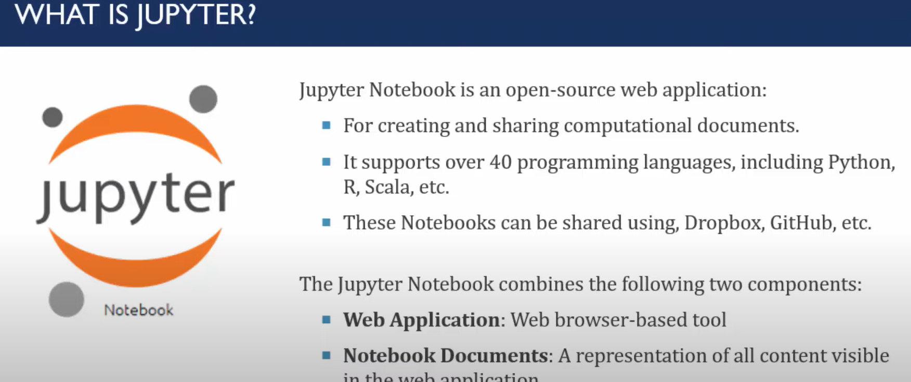
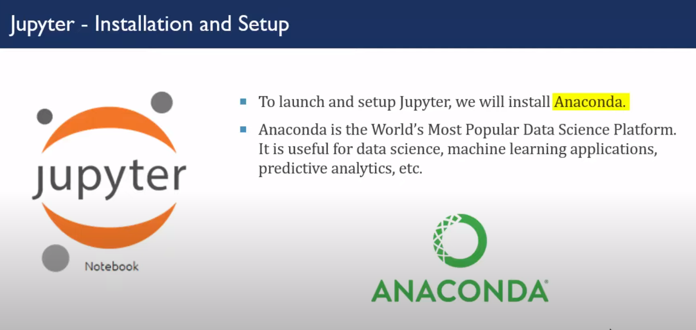

# Table of Contentss
- [Machine Learning](#machine-learning)
  - [Types of Machine Learning](#types-of-machine-learning)
  - [Requirements](#requirements)
  - [Learning Resources](#learning-resources)
- [Jupyter Course for beginners](#jupyter-course-for-beginners)
- [Classical Machine Learning](#classical-machine-learning)
- [Deep Learning](#deep-learning)

# Machine Learning
## Types of Machine Learning
1. Classical Machine Learning
2. Deep Learning(complex than classical machine learning)

## Requirements
1. Minimum one programming language(Python) [Learn-Python](https://learn-python.org)
2. Anaconda(Python and machine learning all packages are available within this software package) 
or google Colab
- jupiter notebook(write code) & other libraries required for machine learning
- Library Machine Learning{ 
    `pandas`(data processing:used for data cleaning, transformation, and analysis.)
    `scikit_learn`(algorithms accessible:It provides a wide range of machine learning algorithms for classification, regression, clustering, dimensionality reduction, and more.)
    `numpy`  for numerical computing in Python
    }
- For deep learning(`TensorFlow`,`Keras`: there have library in anaconda for combined this two)
3. Dataset
- Resource: [kaggle.com](http://kaggle.com)

## Learning Resources
1. Book
- `Machine Learning:` [cookbook](https://drive.google.com/file/d/1bF1zRPvH18sGKJuDBlkaSVuT0siigj-K/view?usp=sharing) by using this book learn how to  train data model by python language
[Absolute Beginners](https://drive.google.com/file/d/1oy6AmdT8OgxZUYSd2P5uWOHuTV0njIPZ/view?usp=sharing) by using this book learn the basics concept of model
- `Deep learning:` [Ian Goodfellow](https://drive.google.com/file/d/1ZZxfvXZoVRBJc8rqmH2pUjg8G9cWiYox/view?usp=sharing) A to Z for Deep Learning
2. Tutorial 
3. Online Course
- Coursera course:[Andrew Ng](https://www.deeplearning.ai/short-courses/) this is his website for courses 

## flower detection
1. Features selection so that we can distinguish between two flower
2. 
# Jupyter Course for beginners 
1. Jupyter notebook- introduction

- 
2. Install anaconda on windows for jupyter notebook

3. Lunch jupyter notebook for the first time
- open anaconda then run jupyter notebook then create folder then file then run program
4. create a new notebook in jupyter 
- create a new notebook in create folder
5. Working with cells in jupyter notebook
- 
6. Types of cells in jupyter
7. Add Heading in jupyter notebook
8. Show line numbers in jupyter notebook
9. setup Numpy in jupyter notebook
10. setup pandas in jupyter notebook
11. setup Matlab in jupyter notebook
12. Download notebook in various formats on jupyter 
13. Import notebook into jupyter notebook
14. open already created Notebook in jupyter notebook
15. keyboard shortcuts in jupyter notebook 
> # Classical Machine Learning
- Three types of Machine Learning
1. `Supervised Learning`
- Level required(output): Level means what we are going to predict that we know the value
- classification, regression problem
- Develop predictive model based on both input and output data
2. `Unsupervised Learning`
- Not Level required(output)
- clustering
- If there don't have level then it will be unsupervised learning
- Group and interpret data based only on input data
3. `Reinforcement Learning`
- first learn then take action

> # Deep Learning

## Project Report
- Introduction 
- Proposed methodology 
- Dataset Description 
- preprocessing() 
- Image segmentation(Feature extraction) or feature engineering 
- Method/model description or method apply 
- Results Analysis 
- conclusion 

